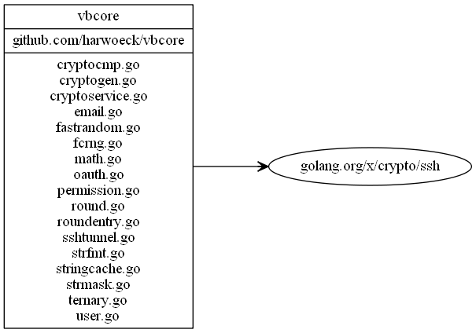

# vbcore

Common core features for all vikebot applications written in go. Including time caches, formating, users, logging, ...

## Dependency diagram

Generate using `goviz -i github.com/vikebot/vbcore -d 1 | dot -Tpng -o diagrams/vbcore-dependency.png`

